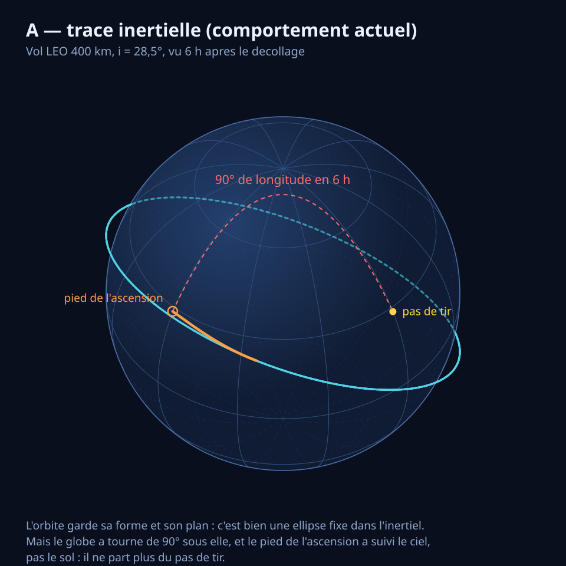
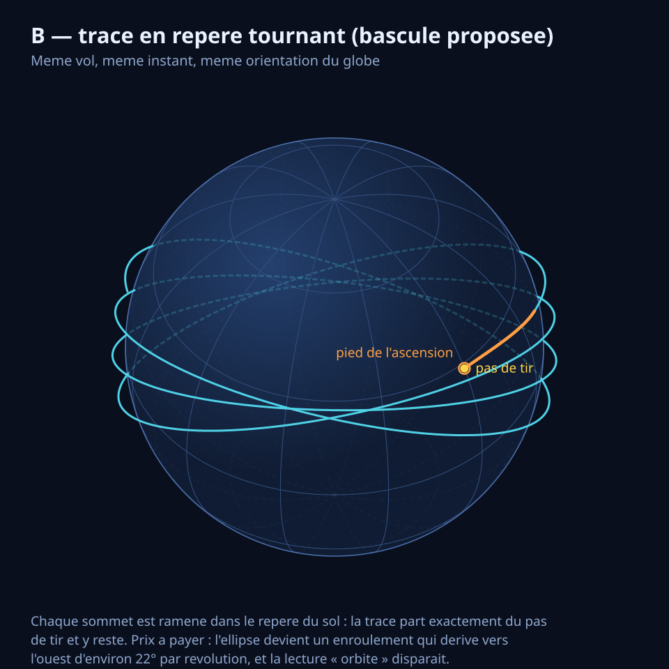

# Spec — Repère d'affichage des trajectoires de mission

Item roadmap : `RND-5`. Ce document est né d'une observation à l'écran — « les
trajectoires de mission se désynchronisent avec le temps par rapport au mouvement
propre de la Terre » — et de sa vérification. L'observation est juste ; la
conclusion qu'on en tirerait spontanément, non : il n'y a rien à corriger.

## 1. Ce qui se passe, et pourquoi ce n'est pas un défaut

Trois faits, tous vérifiés dans le code :

1. **La trajectoire est inertielle.** Les sommets sont en GCRF. Le pas de tir est
   converti une seule fois, à la date de lancement :
   `itrf.getTransformTo(gcrf, initialDate)` (`EarthMission.java:52`). Rien ne le
   reconvertit ensuite, et c'est correct.
2. **Rien ne fait tourner la ligne.** `MissionTrajectoryRenderer.update(…)`
   n'applique qu'une échelle et une convention d'axes, puis pose une translation.
   La géométrie est attachée à `nearOrbitsNode`, lui-même sous `nearFrame`, que le
   repère flottant **translate** sans jamais le tourner (`SceneGraph.java:59-61`).
3. **Le globe, lui, tourne pour de vrai.** `PlanetPresenter.updatePose` applique la
   rotation échantillonnée dans le dataset, qui vaut `icrf.getTransformTo(bodyFrame, t)`
   (`ChunkComputerV1.java:156`) — l'orientation IAU/ITRF réelle, pas une approximation
   à taux constant.

Donc : **globe tournant, tracé fixe dans l'inertiel**. L'écart croît de 15,04 °/h
et boucle en un jour sidéral (23 h 56 min 04 s). Six heures après le décollage, le
pied de l'ascension est à 90° de longitude du pas de tir. S'y ajoute, plus
lentement et tout aussi physiquement, la précession nodale J2 — de l'ordre de
7 °/jour pour une LEO à 400 km inclinée à 28,5° : le plan orbital dérive aussi
*dans* l'inertiel.

Ce qui n'est **pas** désynchronisé, et qu'il vaut la peine d'exclure explicitement :
la translation. Le repère near est centré sur le corps, la traînée suit la Terre
autour du Soleil exactement.

> Il n'y a donc pas de bug à corriger. Ce qui manque est une **aide à la lecture** :
> on dessine une traînée inertielle sur un globe tournant, et rien dans l'image ne
> dit au lecteur laquelle des deux bouge.

### 1.1 Les deux lectures, sur le même vol

Même vol (LEO 400 km, i = 28,5°, 3,9 révolutions), même instant T+6 h, même
orientation du globe. Seule change la façon d'exprimer les sommets. Les deux
figures sont calculées, pas dessinées ; le script qui les produit est versionné à
côté d'elles (`images/rnd5-frames.py`).





La première garde la lecture *orbitale* — une orbite n'est une conique que dans
l'inertiel — et perd l'ancrage au sol. La seconde fait l'inverse.

## 2. Ce que fait le domaine

La répartition est stable d'un outil de trajectoire à l'autre, et elle tranche la
question « quel repère est naturel » :

| Usage | Repère | Ce qu'on y lit |
|---|---|---|
| Vue 3D d'orbite (STK, GMAT `OrbitView`, FreeFlyer) | **inertiel**, par défaut | la conique, le plan, les manœuvres |
| Trace au sol | tournant, presque toujours sur une carte 2D séparée | la géographie, les stations, la couverture |
| Ascension, rentrée, sites de tir | tournant | l'azimut, l'empreinte |
| GEO / maintien à poste | tournant | un géostationnaire devient un **point** |
| Lagrange, halo | tournant (synodique) | ces orbites n'existent que là |
| Rendez-vous, proximité | LVLH / RIC, centré cible | l'approche relative |

Deux conséquences pour nous. D'abord, **le défaut inertiel est la convention**, et
le repère tournant s'offre en second — souvent dans une *autre fenêtre*, justement
parce que les deux lectures cohabitent mal dans la même image. Ensuite, OrbitLab
n'a pas de carte 2D et n'en veut pas : **la trace 3D enroulée est notre substitut
de carte**.

## 3. Décision

**Une bascule globale, deux repères, défaut inertiel.**

- *Globale*, pas par mission. Comparer deux trajectoires affichées dans deux
  repères différents n'a pas de sens : ce n'est pas « pas maintenant », c'est
  jamais. La granularité par mission est écartée définitivement, et la raison est
  écrite ici pour qu'on ne la re-propose pas.
- *Défaut inertiel*, conformément au §2 et parce que c'est le comportement actuel :
  la bascule n'a rien à démentir tant qu'on ne la touche pas.
- *Pas liée au mode de vue*. Imposer le repère tournant en vue PLANET donnerait
  zéro interaction, et zéro contrôle : le repère est une question posée par
  l'utilisateur, pas une conséquence de l'endroit où il regarde.

## 4. Design retenu

### 4.1 Production des sommets — une fois, hors du thread de rendu

`TrajectoryPolyline` gagne un second tableau de positions, en repère lié au corps,
calculé à la construction :

```
bodyFixed[i] = gcrf.getStaticTransformTo(itrf, times[i]).transformPosition(positions[i])
```

Au plus 8 192 transformées par mission, une seule fois, sur le thread
d'optimisation. Coût mémoire de l'ordre de 400 Ko par mission — 196 Ko de charge
utile, le reste en en-têtes d'objets et en références, `Vector3D` étant une classe
et non un enregistrement de valeurs. La classe reste immuable et
publiable au thread de rendu, ce que son Javadoc promet déjà.

Le couple de repères vient du corps central de l'objectif de la mission :
GCRF→ITRF pour la Terre, le repère body-oriented du corps le jour où une mission
lunaire arrivera. C'est le même choix de source que celui du dataset d'éphéméride
(§1, fait 3), et ce n'est pas un hasard : voir l'invariant du §4.3.

### 4.2 Ce que dessine le renderer

`MissionTrajectoryRenderer.update(…)` lit l'un ou l'autre tableau et pose en plus
une **rotation locale** sur sa géométrie. JME compose `monde = T + R·v`, d'où :

| | inertiel | repère tournant |
|---|---|---|
| `v` (sommets écrits) | `positions[i] − tip` | `bodyFixed[i] − bodyFixedTip` |
| `R` (rotation locale) | identité | rotation corps→ICRF à l'instant courant |
| `T` (translation locale) | `tip` | `tip` — **inchangé** |

C'est ce qui fait tenir l'ensemble. `T` reste la position inertielle du vaisseau
dans les deux cas, donc :

- le sommet de tête retombe **exactement** sur le modèle 3D du lanceur —
  `R·(bodyFixedTip − bodyFixedTip) = 0` — et la traînée s'enroule derrière lui sans
  jamais s'en détacher ;
- la propriété de précision de
  [`spacecraft-view-artefacts.md`](spacecraft-view-artefacts.md) §4 est conservée
  mot pour mot : les sommets restent exprimés relativement à la tête, leur erreur
  reste bornée par leur distance au vaisseau et non par leur distance au géocentre ;
- rien d'autre dans la scène ne bouge : ni la caméra, ni le globe, ni le repère
  flottant.

### 4.3 L'invariant qui casse en silence si on le rate

`R` doit être **le même objet `Rotation`, obtenu par le même chemin et converti par
la même méthode** (`RenderTransform.toRenderQuaternion`) que celle qui oriente le
globe. Deux chemins de conversion donneraient deux orientations à quelques ulps
près, et la trace glisserait lentement sur la surface — le défaut y serait d'autant
plus insidieux que le mode existe précisément pour affirmer qu'elle n'y glisse pas.

C'est la transposition exacte, pour la rotation, de la discipline que le Javadoc de
`JmeVectorAdapter.toJmeBodyRelativePosition` impose déjà pour la translation :
un seul chemin de conversion, et il est interdit de le ré-inliner.

`PhaseNodeMarkers` reçoit la rotation par le même appel qui lui passe déjà l'origine
et la translation, pour la même raison : un marqueur produit par une autre
conversion que la ligne dérive de la différence entre les deux.

### 4.4 L'interrupteur

Une entrée à coche dans le menu applicatif : `AppMenuModel` sait déjà le faire
(`isToggle`, `setChecked`), et c'est le premier client de l'hôte qu'`UI-4` a
construit pour ça.

L'état vit dans `ApplicationContext`, sous la forme d'une petite énumération à deux
valeurs (`INERTIAL` / `BODY_FIXED`), **pas** dans l'AppState du menu : le renderer
doit pouvoir le lire, et la règle « aucun `getState(Class)` » de
[`dette-technique.md`](../dette-technique.md) §6.5 interdit l'autre voie.

### 4.5 Ce que la bascule ne touche pas

Le globe, la caméra, le modèle du vaisseau, le repère flottant, la timeline — et
les **orbites planétaires**, qui sont héliocentriques : un repère terrestre tournant
n'a aucun sens pour elles. Une seule chose change : quel tableau de sommets est lu.

## 5. Ce que devient le code

- `TrajectoryPolyline` — un second tableau, un accesseur, et la transformation à la
  construction. C'est le seul endroit qui connaît les deux repères.
- `MissionTrajectoryRenderer` — choisit le tableau, pose la rotation locale, la
  passe aux marqueurs.
- `PhaseNodeMarkers` — un paramètre de plus, aucune logique de plus.
- `ApplicationContext` — l'énumération et son accesseur.
- L'AppState du menu — une entrée, un branchement.

## 6. Tests

Sans contexte GL, comme le reste de ce qui décide dans ce dépôt :

- **aller-retour** : pour tout `i`, la rotation corps→ICRF à `times[i]` appliquée à
  `bodyFixed[i]` redonne `positions[i]`, à la tolérance numérique près ;
- **coïncidence de la tête** : en repère tournant, le dernier sommet dessiné, une
  fois composé avec `R` et `T`, tombe sur la position inertielle du vaisseau — c'est
  la forme testable du §4.2, et c'est l'invariant dont dépend « la traînée ne se
  détache pas du lanceur » ;
- **immutabilité** : le second tableau n'est ni publié ni mutable après
  construction, au même titre que le premier ;
- **le défaut par défaut** : sans intervention, le repère actif est `INERTIAL` et
  les sommets écrits sont bit à bit ceux d'aujourd'hui. C'est le test de
  non-régression du lot.

Une vérification visuelle reste nécessaire pour juger l'enroulement ; elle est notée
comme telle, pas déguisée en test.

## 7. Un effet de bord gratuit, à ne pas consommer ici

En repère tournant, les sommets derrière la tête **ne changent plus jamais** — ils
sont fixes dans le repère où ils sont écrits. Le buffer devient append-only, ce qui
est exactement le ré-ancrage paresseux que [`ribbon-lines.md`](ribbon-lines.md) §8
consigne comme hors périmètre. À noter, pas à faire ici : c'est un changement de la
logique de précision, il mérite son propre raisonnement.

## 8. Hors périmètre

- **`RND-4` (ruban).** Aucune dépendance dans un sens ni dans l'autre : le ruban
  change la primitive dessinée, cette bascule change le contenu du buffer. Les deux
  peuvent partir dans n'importe quel ordre.
- **Trace au sol** ([`effects-roadmap.md`](effects-roadmap.md) §9.4.4). C'est
  l'autre réponse au même besoin — un second ruban collé à la surface, gardant
  l'ellipse inertielle au-dessus. Elle reste une concurrente sérieuse, et les deux
  ne sont pas exclusives.
- **Le vieillissement de la traînée** — fondu de queue ou fenêtrage temporel
  ±N h (`ribbon-lines.md` §11.6, `effects-roadmap.md` §9.5.5). Cette bascule ne le
  traite pas, et le rend même plus désirable : un enroulement s'accumule visuellement
  plus vite qu'une ellipse qui se superpose à elle-même.
- **LVLH / repère cible.** `MIS-6` (rendez-vous) ne se lit que là, donc un troisième
  repère d'affichage arrivera. Ça ne justifie pas de construire une abstraction
  maintenant — ça justifie d'appeler la chose « repère d'affichage » plutôt que
  « bascule ECEF », pour ne pas fermer la porte. C'est d'ailleurs le raisonnement
  qui a fait **dissoudre `MIS-3`** le 2026-08-20, l'item qui portait LVLH avant :
  il est reversé dans `MIS-6`, son seul consommateur.
- **Corps autres que la Terre.** Le §4.1 dit d'où viendrait le repère, rien de plus :
  aucune mission non terrestre n'existe encore.

## 9. Reste ouvert

- **La valeur de la bascule n'est pas mesurée à l'écran.** Les figures du §1.1 sont
  un calcul, pas une capture de l'application ; l'enroulement réel, avec le codage
  de phase de `RND-3` par-dessus, peut être plus confus que la figure ne le laisse
  croire. C'est le premier retour à prendre.
- **L'intitulé de l'entrée de menu** n'est pas arrêté. « Repère tournant » est exact
  et jargonneux ; « Suivre la rotation de la Terre » est parlant et faux le jour où
  une mission lunaire arrive.
- **Le seuil de gêne** entre cette bascule et la trace au sol (§8) n'est pas tranché :
  si la trace au sol est livrée un jour, une partie du besoin qui motive cette
  bascule disparaît. L'ordre entre les deux se décidera à l'usage.
