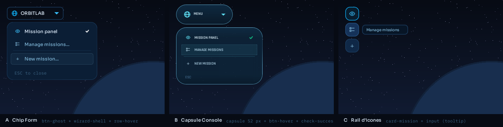
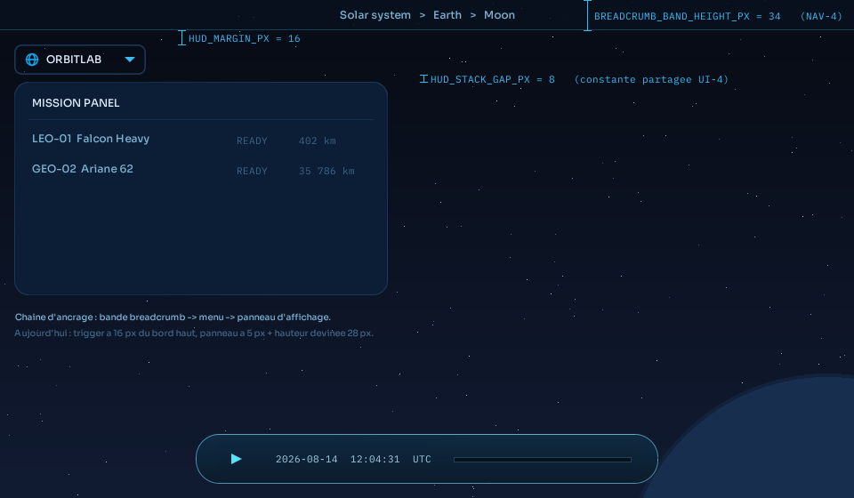

# Spec — Menu applicatif haut-gauche (`UI-4`)

> **Rédigé, tranché et livré le 2026-08-14** (item `UI-4` de la roadmap,
> phase 2, ★3 ◆2 M). §9 note les deux écarts entre le code livré et §6.
> §4 conserve les trois variantes maquettées sur les textures
> déjà présentes dans `src/main/resources/interface/` ; **la variante A (« chip
> formulaire ») est retenue** (§5), et §6 décrit ce qu'elle implique dans le
> code. Les points 1 à 4 de la fiche roadmap (skin, état grisé menteur, absence
> d'hôte pour les entrées d'`UI-3`, ancrage) sont tous couverts.
>
> **Arbitrages tranchés le 2026-08-14** — variante **A** ; libellé du
> bouton-titre **`ORBITLAB`** ; **pas de raccourci clavier** ; **une icône par
> entrée** dès la v1. Aucune question ouverte ne reste (§8).

---

## 1. Contexte — ce qui existe aujourd'hui

Le haut-gauche de l'écran n'a qu'un point d'entrée : `MissionPanelTrigger`, un
bouton « Missions » qui bascule `MissionDisplayPanelWidget`. C'est **le seul
élément de HUD visible en permanence** avec la capsule de la timeline, et il
porte quatre défauts, dont un seul est cosmétique.

| # | Défaut | Où |
|---|---|---|
| 1 | Adopte `FormStyles.STYLE` puis **réécrit à la main les quatre attributs que ce style fournit** (`background`, `color`, `font`, `insets`). Là où le sélecteur `button` de `FormStyles` pose un fond `btn-ghost`, il pose un aplat `UiKit.gradientBackground(AppStyles.ICE_ACCENT)` — seul bouton de l'application dans ce cas. | `ui/mission/panel/MissionPanelTrigger.java:26-30` |
| 2 | Le Javadoc de `setEnabled(boolean)` présente le grisé comme « le panneau est déjà ouvert », alors que `togglePanel()` grise quand le panneau se **ferme**. L'un des deux ment depuis toujours. | `MissionPanelTrigger.java:45-48` vs `states/mission/MissionDisplayPanelAppState.java:82-91` |
| 3 | `publishOpenWizard()` est écrit et **n'est appelé de nulle part** : la création de mission n'a aucune entrée depuis le HUD. Un bouton unique n'a de toute façon pas de place pour les deux entrées qu'`UI-3` demandera (charger / enregistrer un scénario). | `MissionDisplayPanelAppState.java:97-99` |
| 4 | Le bouton se pose à `AppStyles.HUD_MARGIN_PX = 16`, le panneau qu'il ouvre à `MARGIN_PX = 5` avec une hauteur de déclencheur **devinée** `TRIGGER_HEIGHT = 28`. Deux éléments empilés, deux marges : le panneau est 11 px à gauche du bouton et son offset vertical ne correspond à aucune mesure réelle. | `ui/mission/display/MissionDisplayPanelWidget.java:34-36,176-178` |

Le défaut 1 explique l'impression d'« élément importé d'une autre interface » :
l'application a deux familles visuelles cohérentes — la **famille formulaire**
(`wizard-shell`, `btn-ghost`, Sora, bleu `#38bdf8`) pour les surfaces
modales, et la **famille capsule** (`capsule`, Rajdhani, cyan `#5ee0f5`) pour
la console de temps — et le trigger n'appartient à aucune des deux.

---

## 2. Assets disponibles

Tout ce qui suit est **déjà dans le dépôt** (`src/main/resources/interface/`,
tracké : seul `resources/models/` est exclu). Aucune variante ci-dessous ne
demande de nouvelle texture.

### 2.1 Fonds (9-slice)

| Asset | Taille | Inset | Utilisé aujourd'hui par | Emploi possible |
|---|:-:|:-:|---|---|
| `wizard/btn-ghost.png` | 18×18 | 8 | sélecteur `button` de `FormStyles` | fond du bouton-titre (variante A) |
| `wizard/btn-ghost-hover.png` | 18×18 | 8 | boutons du wizard | survol du bouton-titre |
| `wizard/wizard-shell.png` | 34×34 | 16 | `FormStyles.shellBg()` — wizard, panneau d'affichage | fond du déroulé (variante A) |
| `wizard/input.png` / `input-focus.png` | 18×18 | 8 | champs, `PopupList` | fond du déroulé alternatif, tooltip (variante C) |
| `missions/row-hover.png` | 24×24 | 8 | lignes du panneau de missions | survol d'une entrée |
| `missions/row-selected.png` | 24×24 | 8 | ligne sélectionnée | entrée cochée (alternative à la coche) |
| `wizard/card-mission*.png` | 28×28 | 12 | cartes du wizard (4 états) | boutons carrés du rail (variante C) |
| `timeline/capsule.png` | 54×54 | 26 | `TimelineWidget` | bouton-titre et déroulé (variante B) |
| `timeline/btn-hover.png` / `btn-active.png` | 8×8 | 3 | transport de la timeline | survol d'une entrée (variante B) |

> **Contrainte mesurée sur `capsule.png`** : inset 26 sur une texture 54×54 —
> en dessous de ~52 px de hauteur les coins du 9-slice se recouvrent et la
> pilule devient un ovale écrasé. `TimelineWidget.CAPSULE_HEIGHT` vaut
> justement `52f`. Une variante « capsule » impose donc un bouton de 52 px de
> haut, contre 34 px pour la famille formulaire. Ce n'est pas un détail : la
> bande breadcrumb de `NAV-4` prend déjà 34 px en haut d'écran.

### 2.2 Icônes

| Asset | Taille | Emploi proposé |
|---|:-:|---|
| `wizard/icon-brand-globe.png` | 20×20 | glyphe du bouton-titre (identité applicative) |
| `wizard/icon-caret-down.png` | 12×8 | chevron d'ouverture — déjà ce rôle dans `PopupList` |
| `wizard/icon-check-white.png` | 14×14 | coche de l'entrée bascule (famille formulaire) |
| `wizard/icon-check-success.png` | 14×14 | idem, teinte verte (famille capsule) |
| `missions/icon-action-view.png` | 64×64 | entrée *Mission panel* (œil) |
| `missions/icon-action-manage.png` | 64×64 | entrée *Manage missions…* (liste) |
| `wizard/icon-plus.png` | 20×20 | entrée *New mission…* |
| `wizard/lbl-box.png`, `wizard/lbl-edit.png` | 20×20 | réserve pour les entrées *Load / Save scenario* d'`UI-3` |

Les icônes d'action des missions sont **multicolores** dans leur usage actuel
(œil cyan, liste magenta, éclair ambre) : dans une liste de menu elles doivent
être **teintées uniformément** (secondaire au repos, accent sur l'entrée
cochée), sinon le déroulé vire au sapin de Noël. C'est une teinte de composant,
pas un nouvel asset.

### 2.3 Ce qui manque — et pourquoi ça ne bloque pas

- **Pas de glyphe « burger »** : le couple `icon-brand-globe` + `icon-caret-down`
  suffit et dit mieux « menu applicatif » qu'un burger dans une application 3D.
- **Pas de séparateur horizontal** : `timeline/divider.png` est vertical (1×20).
  Un `Panel` de 1 px teinté `FormStyles.BORDER` fait le travail, comme le fait
  déjà `TimelineWidget.placeDivider()` dans l'autre sens.
- **Pas d'infrastructure de tooltip** dans le projet (aucune occurrence de
  `Tooltip` dans `src/main/java`). C'est ce qui coule la variante C, voir §4.3.

---

## 3. Décisions de conception

Comportement, contenu et ergonomie du menu. Ces points ne dépendent pas de
l'habillage : ils valaient pour les trois variantes de §4, à l'exception du
libellé du bouton-titre, tranché avec la variante (§5).

| Sujet | Décision |
|---|---|
| Forme générale | Bouton-titre ancré haut-gauche + liste déroulante. **Pas** de barre de menus type bureautique (Fichier / Édition / Affichage) — un seul point d'entrée, comme le dit la fiche roadmap. |
| Libellé du bouton-titre | **`ORBITLAB`**, précédé du glyphe `icon-brand-globe` et suivi du chevron. Le HUD n'affiche aujourd'hui le nom de l'application nulle part ; le seul élément permanent du haut d'écran le porte. |
| Entrées v1 | *Mission panel* (bascule, avec coche) · *Manage missions…* (`OpenMissionManagement`) · *New mission…* (`OpenMissionWizard` — ce qui donne enfin un appelant à `publishOpenWizard`). |
| Icônes des entrées | **Une icône par entrée dès la v1**, 16 px, alignée à gauche du libellé, avec 6 px entre les deux. Teinte uniforme — `TEXT_SECONDARY` au repos, `ACCENT_BRIGHT` sur l'entrée cochée — jamais les couleurs natives des assets (cf. §2.2). Les entrées d'`UI-3` arriveront donc dans une gouttière d'icônes déjà en place. |
| Langue | Anglais, comme le reste de l'UI. |
| État de la bascule | **Une coche sur l'entrée**, jamais une opacité sur le bouton-titre. `MissionPanelTrigger.setEnabled(boolean)` disparaît : le défaut 2 n'est pas corrigé, il devient sans objet. La coche lit `MissionDisplayPanelWidget.isVisible()`, source de vérité unique. |
| Ouverture / fermeture | Click sur le bouton-titre bascule. Click sur une entrée exécute **et** ferme. Click hors du menu ferme. `ESC` ferme. |
| Entrées désactivées | Affichées en `TEXT_LO`, non cliquables, **le menu reste ouvert** si on clique dessus. Aucune entrée n'est désactivée en v1 ; la règle existe pour `UI-3` (pas de *Save scenario…* sans mission). |
| Raccourci clavier | **Aucun raccourci d'ouverture.** Le menu s'ouvre à la souris ; `R` (`ViewModeAppState`) reste le seul binding du HUD, on n'en sème pas un deuxième pour une cible de 148×34 px toujours visible. `ESC` ferme un menu **déjà ouvert** : c'est une sortie de surface, pas un raccourci à mémoriser. |
| Habillage | Un **sélecteur Lemur déclaré dans `FormStyles`**, jamais d'override d'attribut à la construction. C'est la règle que ce chantier est censé établir — cf. §6.1. |
| Ancrage | Une constante partagée remplace `MARGIN_PX = 5` / `TRIGGER_HEIGHT = 28` du panneau d'affichage. Chaîne : bande breadcrumb (`NAV-4`) → menu → panneau. Voir §6.3 et la figure `01-menu-ancrage.png`. |
| Logique testable | Un modèle pur, hors cycle de vie JME, testé unitairement — comme `MissionDisplayPanelRules` l'a fait pour le panneau. Voir §6.4. |

---

## 4. Les trois variantes étudiées

Les trois ont été maquettées avant l'arbitrage ; **A est retenue**, B et C sont
conservées ici pour garder trace de ce qui a été pesé.



*Maquette, pas capture. Les trois vignettes sont composées **avec les textures
et les polices bitmap réelles du dépôt** (9-slice reproduit à l'identique,
glyphes tirés des `.fnt`), donc les proportions et les couleurs sont justes.
Ce qui les sépare du rendu final : le fond étoilé est décoratif, l'anticrénelage
des polices diffère de celui de JME, et les états survol/coché sont montrés
simultanément alors qu'ils ne coexistent pas à l'écran.*

### 4.1 Variante A — « Chip formulaire » ✅ *(retenue)*

Bouton-titre `btn-ghost` 148×34, globe 16 px, libellé `ORBITLAB` en Sora 12,
chevron `icon-caret-down` teinté `ACCENT_BRIGHT`. Déroulé sur `wizard-shell`
(236 px de large), entrées de 30 px, survol sur `row-hover`, coche
`icon-check-white` alignée à droite, séparateur 1 px avant *New mission…*.

- **Pour** — le menu ouvre exclusivement des surfaces de la famille formulaire
  (panneau d'affichage en `wizard-shell`, modale de gestion, wizard) : le
  déroulé est visuellement le haut de cette pile, continu avec le panneau qu'il
  commande. Le bouton-titre est littéralement
  `new Button("ORBITLAB", FormStyles.STYLE)` **sans un seul override** — la
  conformité la plus directe possible à la règle que le chantier veut poser.
  34 px de haut : le moins cher en surface de HUD permanent.
- **Contre** — deux langages visuels cohabitent à l'écran (formulaire en haut,
  capsule en bas). Le libellé `ORBITLAB` n'est pas une action ; il se justifie
  comme identité applicative dans un HUD qui n'en a aucune, mais `MENU` reste
  possible sans rien changer d'autre.

### 4.2 Variante B — « Capsule console » *(écartée)*

Bouton-titre `capsule` **148×52** (hauteur imposée par l'inset, cf. §2.1),
globe teinté `TL_CYAN`, libellé `MENU` en Rajdhani 14, chevron cyan. Déroulé
également sur `capsule`, survol sur `timeline/btn-hover`, coche
`icon-check-success`.

- **Pour** — un seul langage pour tout ce qui est **visible en permanence** :
  la capsule. `NAV-2` ajoutera une « capsule jumelle » en bas d'écran ; avec
  cette variante le HUD permanent devient une famille de capsules et le menu
  n'est plus une exception.
- **Contre** — 52 px de haut au lieu de 34, sous une bande breadcrumb qui en
  prend déjà 34 : 86 px d'écran mangés avant le premier pixel de contenu. Et
  le déroulé, en capsule, se pose **au-dessus d'un panneau en `wizard-shell`** :
  la rupture de famille n'est pas supprimée, elle est déplacée d'un cran plus
  bas. Lecture concurrente possible : la capsule est le langage du **temps**
  (transport, horloge, scrubber), pas celui de l'application.

### 4.3 Variante C — « Rail d'icônes » *(écartée)*

Trois boutons carrés 36×36 empilés (`card-mission` / `-hover` / `-selected`),
icônes 20 px, libellé en tooltip sur `input`.

- **Pour** — le moins de surface écran, aucune logique de popup, états
  survol/actif/désactivé déjà fournis par les quatre textures `card-mission`.
- **Contre, et c'est rédhibitoire** — la fiche roadmap demande explicitement un
  « bouton-titre + liste déroulante », et surtout un **hôte pour les entrées
  d'`UI-3`** : un rail d'icônes ne reçoit pas *Load scenario…* / *Save
  scenario…* sans devenir un mur de pictogrammes illisibles. Le tooltip de la
  maquette n'existe pas : il faudrait le construire (aucune infrastructure de
  tooltip dans le projet), ce qui annule l'économie promise.

---

## 5. Décision

**Variante A, tranchée le 2026-08-14**, avec le libellé `ORBITLAB` — le repli
`MENU` a été écarté : le HUD n'affiche le nom de l'application nulle part, et
c'est le bon endroit pour le porter.

Quatre raisons, par ordre de poids :

1. **Le menu n'ouvre que des surfaces de la famille formulaire.** Ses trois
   entrées v1 mènent au panneau d'affichage (`wizard-shell`), à la modale de
   gestion et au wizard. Un déroulé en `wizard-shell` est le prolongement de ce
   qu'il commande ; la variante B pose une capsule au-dessus d'un `wizard-shell`
   et garde donc, à un cran près, le problème qu'`UI-4` veut résoudre.
2. **Elle est la démonstration de la règle que le chantier doit établir.** Le
   bouton-titre est un `Button(FormStyles.STYLE)` sans override, et les entrées
   demandent **un** sélecteur de plus (`menu.item`, §6.1). C'est exactement la
   phrase de la roadmap — « s'il lui faut une autre allure, c'est un sélecteur
   de plus » — rendue littérale.
3. **Coût en surface.** 34 px contre 52, sous une bande breadcrumb de 34 px
   qui arrive avec `NAV-4`.
4. **Séparation de sens tenable dans la durée.** Capsule = temps (transport,
   horloge, scrubber, et la piste de `NAV-2`) ; formulaire = missions et
   application. Chaque famille garde un domaine, au lieu d'être un simple
   héritage de deux lots de textures.

Ce qui rouvrirait le sujet : décider que tout le HUD permanent parle capsule.
La variante B est jouable telle quelle, mais il faudrait alors l'assumer
jusqu'au bout et repasser aussi le **panneau d'affichage** en capsule — ce qui
sort du périmètre d'`UI-4` et n'est pas retenu ici.

---

## 6. Ce que la variante A implique dans le code

### 6.1 Styles — les sélecteurs à déclarer dans `FormStyles.init()`

```java
// Bouton-titre : rien à déclarer, le sélecteur "button" du style form suffit.
//   new Button("ORBITLAB", FormStyles.STYLE)  -> btn-ghost + Sora 13 + TEXT_PRIMARY

Attributes menu = styles.getSelector("menu", STYLE);          // conteneur du déroulé
menu.set("background", shellBg());
menu.set("insets", new Insets3f(8, 0, 8, 0));

Attributes item = styles.getSelector("menu.item", STYLE);     // une entrée
item.set("background", null);                                 // posé au survol seulement
item.set("color", TEXT_SECONDARY);
item.set("font", UiKit.sora(12));
item.set("insets", new Insets3f(7, 16, 7, 16));
```

Une entrée est une ligne `BoxLayout(Axis.X)` : icône 16 px teintée, 6 px de
gouttière, libellé, puis la coche alignée à droite pour la seule entrée
bascule. Toutes les entrées portant une icône (§3), la gouttière est constante
et les libellés restent alignés quoi qu'ajoute `UI-3`.

L'entrée survolée reçoit `UiKit.textureBg("row-hover", 8)`, l'entrée cochée
`TEXT_PRIMARY`, son icône `ACCENT_BRIGHT` et la coche `icon-check-white`. **Aucun `setBackground` / `setColor` /
`setFont` / `setInsetsComponent` à la construction** en dehors de ces
transitions d'état : c'est la règle qui sort du chantier, et elle vaut ensuite
pour le breadcrumb (`NAV-4` §3) et le toggle de la piste temporelle (`NAV-2`
§11), qui devaient tous deux recopier `MissionPanelTrigger`.

### 6.2 Classes

| Classe | Emplacement | Rôle |
|---|---|---|
| `AppMenu` | `ui/menu/` | Widget Lemur : bouton-titre + déroulé, purement présentation, callbacks vers l'`AppState`. |
| `AppMenuItem` | `ui/menu/` | Record d'une entrée : `id`, `label`, `iconName` (**obligatoire**, cf. §3), `kind` (`ACTION` ou `TOGGLE`). |
| `AppMenuModel` | `states/mission/` (ou `states/hud/`) | Logique pure : ouvert/fermé, coches, entrées actives. Testable sans JME. |
| `MissionPanelTrigger` | — | **Supprimée.** `MissionDisplayPanelAppState` instancie `AppMenu` à la place. |

`PopupList` (`ui/mission/wizard/component/`) implémente déjà le motif
trigger + popup avec survol et fermeture au click extérieur, mais c'est un
sélecteur de **valeur** (options `String`, `Consumer<String>`, valeur courante
affichée dans le trigger). Le menu n'a ni valeur courante ni sélection unique,
mais des icônes et une coche : dupliquer le motif est ici moins coûteux que de
généraliser `PopupList`. Si un troisième déroulé apparaît — le dropdown des
fils du breadcrumb V2 est le candidat évident — c'est le moment d'extraire le
comportement commun, pas avant.

### 6.3 Ancrage

`AppStyles` gagne les constantes partagées, et `MissionDisplayPanelWidget`
perd ses trois locales :

```java
public static final float HUD_MARGIN_PX      = 16f;  // existe déjà
public static final float HUD_MENU_HEIGHT_PX = 34f;  // hauteur réelle du bouton-titre
public static final float HUD_STACK_GAP_PX   = 8f;   // écart entre deux widgets empilés
```

Le panneau se pose alors à `x = HUD_MARGIN_PX` (au lieu de 5, donc enfin aligné
sur le menu) et `y = topOffset + HUD_MENU_HEIGHT_PX + HUD_STACK_GAP_PX`, où
`topOffset` vaut `HUD_MARGIN_PX` aujourd'hui et
`BREADCRUMB_BAND_HEIGHT_PX + HUD_MARGIN_PX` une fois `NAV-4` livré
(`navigation/01-breadcrumb.md` §5.5).



*Maquette. La bande breadcrumb figurée en haut est celle de `NAV-4`, qui n'est
pas encore implémentée ; `UI-4` doit seulement rendre l'offset paramétrable,
pas la dessiner.*

### 6.4 Logique testable

`AppMenuModel` ne connaît ni Lemur ni JME :

```java
boolean isOpen();
void toggle();
void close();
List<AppMenuItem> items();
boolean isChecked(String itemId);
boolean isEnabled(String itemId);
Optional<String> select(String itemId);   // vide si l'entrée est désactivée
```

Cas couverts par `AppMenuModelTest` : ouverture/fermeture par bascule ;
`select` sur une entrée active ferme le menu et rend son id ; `select` sur une
entrée désactivée ne ferme pas et ne rend rien ; la coche de *Mission panel*
suit l'état passé au modèle ; `close()` sur un menu déjà fermé est un no-op.

### 6.5 Fermeture au click extérieur

`ModalBackdrop` consomme déjà tous les événements souris plein écran et
appelle un callback au click — exactement ce qu'il faut — mais il pose un fond
noir à 60 %, inacceptable pour un menu. Proposition : lui ajouter un
constructeur prenant la teinte, et instancier le catcher du menu avec un
`ColorRGBA` totalement transparent. Le comportement bloquant est ici **désiré** :
menu ouvert, un click dans la scène 3D ferme le menu sans sélectionner de
corps.

Z-order : le déroulé reste dans `missionPanelNode` avec un `z` local
au-dessus du panneau d'affichage (le bucket GUI rend les `z` élevés en
premier), et non dans `modalNode` — un menu n'est pas une modale.

### 6.6 Périmètre exact du diff

- **Ajouté** : `ui/menu/AppMenu`, `ui/menu/AppMenuItem`, `AppMenuModel` + son
  test, deux sélecteurs dans `FormStyles.init()`, deux constantes dans
  `AppStyles`, un constructeur teinté sur `ModalBackdrop`.
- **Modifié** : `MissionDisplayPanelAppState` (instancie le menu, câble les
  trois entrées, appelle enfin `publishOpenWizard`), `MissionDisplayPanelWidget`
  (constantes d'ancrage partagées).
- **Supprimé** : `MissionPanelTrigger` et son `setEnabled(boolean)`.

---

## 7. Ce qu'on ne fait pas

- **Pas de barre de menus complète** (Fichier / Édition / Affichage…).
- **Pas de sous-menus** : la v1 est une liste plate. Les entrées d'`UI-3` s'y
  ajoutent à plat, séparateur compris.
- **Pas de raccourci clavier d'ouverture** (§3). Seul `ESC` ferme un menu déjà
  ouvert.
- **Le toggle de la piste temporelle de `NAV-2` n'est pas tranché ici** :
  entrée de menu ou bouton local à son widget, ça se décide en faisant `NAV-2`.
  Ce que `UI-4` doit garantir, c'est qu'il ne recopiera plus ni le skin ni la
  sémantique inversée de `MissionPanelTrigger`.
- **Pas de reprise du panneau d'affichage** au-delà de son ancrage.

## 8. Arbitrages tranchés

Aucune question n'est ouverte : les trois qui l'étaient à la rédaction ont été
tranchées le 2026-08-14, le jour même.

1. ~~**Libellé du bouton-titre** : `ORBITLAB` ou `MENU` ?~~ **`ORBITLAB`.**
   Le HUD n'affiche le nom de l'application nulle part ailleurs.
2. ~~**Raccourci clavier d'ouverture** — `M` sur le motif de `R` ?~~ **Aucun
   raccourci.** Ouverture à la souris uniquement ; `R`
   (`states/camera/ViewModeAppState.java:35-42`) reste le seul binding du HUD.
   `ESC` ferme un menu déjà ouvert et ne compte pas comme un binding à
   mémoriser.
3. ~~**Icônes dans les entrées** dès la v1, ou seulement quand `UI-3` fera
   passer le menu à six entrées ?~~ **Dès la v1**, une par entrée, 16 px,
   teinte uniforme (§3). Les entrées d'`UI-3` arriveront dans une gouttière
   déjà en place, sans reprise de la mise en page.

Ce qui reste hors de ce document et sera tranché ailleurs : le sort du toggle
de la piste temporelle (§7), décidé en faisant `NAV-2`.

---

## 9. Écarts du code livré

Le périmètre de §6.6 est tenu à deux détails près, tous deux découverts en
écrivant le code.

1. **`AppMenuItem` porte un cinquième composant, `separatorBefore`.** §4.1
   demande un séparateur avant *New mission…* et §6.2 ne donnait pas d'endroit
   où l'écrire. Le mettre sur l'entrée garde la liste déclarative : les entrées
   d'`UI-3` diront elles-mêmes si elles ouvrent un groupe, sans que `AppMenu`
   ait à connaître leurs identifiants. Trois fabriques
   (`action`, `toggle`, `withSeparatorBefore`) gardent la construction lisible.

2. **`ESC` : le menu doit prendre la touche à `SimpleApplication`.** §3 fait
   fermer le menu par `ESC` sans dire que JME lie déjà cette touche à
   `SIMPLEAPP_Exit` — un `ESC` quitte l'application aujourd'hui, et l'écouteur
   qui le fait est privé, donc impossible à désinscrire. `MissionDisplayPanelAppState`
   supprime le mapping et pose le sien : menu ouvert, `ESC` le ferme ; sinon il
   appelle `stop()`. Le comportement existant est préservé à l'identique, mais
   la touche appartient désormais au HUD — c'est là que `NAV-4` et les futures
   surfaces viendront s'inscrire plutôt que d'en poser une seconde.

`AppMenuModel` est placé dans `states/mission/`, la première des deux
possibilités de §6.2 : c'est le paquet de l'`AppState` qui l'instancie et de
`MissionDisplayPanelRulesTest`, à côté duquel `AppMenuModelTest` se range.
