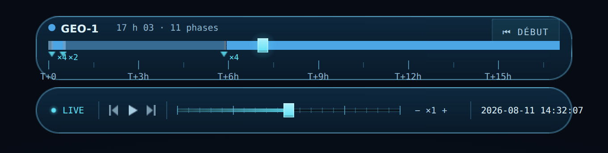

# Spec — Timeline de mission indexée sur le temps

Item roadmap : `NAV-2` (« Timeline indexée sur le temps + marqueurs
d'événements », ★4 ◆3 M). Ce document couvre le **nouveau widget** ; il ne
modifie pas la capsule temporelle existante, sauf sur un point précis
(§12.1, désynchronisation de la vitesse).

> **Révisé le 2026-08-14 — §11 est tranché.** Le toggle garde son emplacement,
> perd son état grisé et prend la condition de présence de la télémétrie.
> Conséquence de la livraison d'`UI-4`, qui a supprimé le `MissionPanelTrigger`
> dont ce document demandait de recopier le motif. Le reste est inchangé.

## 1. Contexte

La capsule en bas d'écran (`ui/timeline/TimelineWidget.java`) porte cinq
composants : indicateur LIVE, transport, horloge UTC éditable, sélecteur de
vitesse et `ScrubberTrack`. Ce dernier **n'a aucune notion de date** : ses 21
graduations (`ui/timeline/components/ScrubberTrack.java:32`) sont décoratives et
sa tête de lecture est indexée sur l'**index de vitesse**
(`ScrubberTrack.java:142`, `refresh(int speedIndex)`, normalisé entre
`SpeedStepper.MIN_INDEX = -16` et `MAX_INDEX = 16`). Une simulation orbitale
dont la seule piste ne représente pas le temps est une anomalie.

Deux chantiers livrés rendent ce chantier possible maintenant :

- **`MIS-8`** (horizon de mission) a donné une durée de mission qui n'est plus
  une constante arbitraire. La fenêtre représentée par une piste temporelle est
  cette durée ; tant qu'elle était arbitraire, la piste l'aurait été aussi.
- **`RND-3`** (encodage des phases de vol) a produit exactement les objets dont
  une piste à marqueurs a besoin : les frontières de phases et leurs couleurs
  (§4).

Objectif : un widget HUD qui affiche **la mission suivie** sur un axe temporel,
avec ses phases de vol, ses transitions d'étages, la position de l'horloge
courante, et deux gestes — aller au début de la mission, aller à un instant.

---

## 2. Le fait qui commande le design

Il est identique à celui qui a commandé `RND-3`
([`mission-phase-encoding.md`](../graphics-effects/mission-phase-encoding.md) §2)
et il frappe ici plus fort encore, parce qu'un axe temporel l'expose sans
l'atténuation que l'arc 3D apportait.

**Les phases propulsées font ~2 % de la durée d'une GEO.** Ascension complète,
séparation d'étage et injection GTO tiennent dans le premier ~1 % de la fenêtre.
Sur une piste de 400 px, cela fait **4 px** pour cinq à six transitions ; une
ascension verticale de 15 s sur une mission de 3 jours occupe **0,02 px**.

Deux conséquences, non négociables :

1. Les segments de phase courts sont **invisibles par construction**, et c'est
   correct : la barre dit la durée, et leur durée est effectivement nulle à
   l'échelle de la mission.
2. Les **marqueurs**, eux, doivent rester atteignables. Un marqueur n'a pas de
   durée : le laisser hériter de la compression de l'axe le rend inutilisable
   précisément là où l'utilisateur veut regarder.

D'où la décision d'axe (§3, ligne « Axe ») : **axe linéaire honnête, marqueurs
déclusterisés**. Un axe non linéaire (par phases, ou logarithmique) rendrait
tous les marqueurs distincts, mais une piste temporelle dont les distances ne
sont pas des durées ment sur la seule chose qu'elle est là pour dire — et elle
mentirait au moment même où `NAV-3` viendra y poser un scrub, où la position du
curseur doit être une date. Le coût du choix linéaire est concentré sur les
marqueurs, et §8 le paie explicitement.

---

## 3. Décisions de conception

| Sujet | Décision |
|---|---|
| Nombre d'instances | **Un seul widget**, jamais N. |
| Mission représentée | Celle du **focus télémétrie** (`MissionContext.getTelemetryFocusMission()`, `MissionContext.java:162`). Pas de second concept de sélection. |
| Fenêtre temporelle | `[eph.startDate(), eph.endDate()]` de l'éphéméride de la mission suivie. |
| Sans éphéméride | **Le widget ne s'affiche pas.** Pas de piste vide, pas d'état dégradé. |
| Axe | **Linéaire** en temps. Aucune déformation. |
| Marqueurs | Un par frontière de `PhaseRun`, déclusterisés (§8). |
| Couleurs | `MissionPhaseShading.shade(missionColor, runs)` — **la même table que la trajectoire 3D**, jamais une seconde. |
| Libellés de graduation | Relatifs au début de mission (`T+…`), pas UTC absolu — l'horloge UTC est déjà dans la capsule. |
| Indicateur `now` hors fenêtre | Épinglé à la borne, **forme distincte** + **écart affiché** (§5.3). |
| Bouton « début de mission » | `seek(startDate − PRE_ROLL)`, `PRE_ROLL` paramétrable, défaut **10 s**. Met l'horloge **en pause** et remet la **vitesse à ×1**. |
| Hover | Tooltip : nom d'étape + date + `T+`. |
| Click sur la piste | `clock.seek(date)`. |
| Drag continu | **Hors périmètre** — c'est `NAV-3`. |
| Traitement visuel | **Capsule jumelle** — 600 × 72, texture 9-slice de la capsule, chrome cyan, couleur de mission réservée au contenu (§6). |
| Emplacement | Bande horizontale **au-dessus de la capsule**, même largeur, même centrage (§11). |
| Toggle | Bouton compact ancré **à gauche, juste au-dessus de la capsule**, présent exactement quand la télémétrie l'est — jamais grisé (§11). |
| Capsule existante | Inchangée. `ScrubberTrack` reste indexé sur la vitesse ; la cohabitation piste-vitesse / piste-temps que redoutait `NAV-3` est résolue par la séparation des widgets. |

---

## 4. Données consommées : aucune plomberie nouvelle

C'est le point qui rend ce chantier petit. Tout ce dont la piste a besoin existe
déjà et est déjà partagé avec le rendu 3D.

| Besoin | Source | Remarque |
|---|---|---|
| Bornes de la fenêtre | `MissionEphemeris.startDate()` / `endDate()` | Le premier et le dernier échantillon sont toujours conservés par la polyline, donc `timeAt(0)` et `timeAt(size−1)` valent les mêmes dates. |
| Frontières de phases | `TrajectoryPolyline.runs()` → `PhaseRun.firstVertex()` | |
| Date d'une frontière | `TrajectoryPolyline.timeAt(firstVertex)` (`TrajectoryPolyline.java:227`) | **Exacte, même après décimation** : la polyline force la conservation du premier échantillon de chaque run (javadoc de `of(...)`). Une frontière de phase n'est jamais décalée. |
| Libellé d'une phase | `PhaseRun.stageName()` | Chaîne libre choisie par la mission ; on l'affiche, on ne l'interprète pas. |
| Couleur d'une phase | `MissionPhaseShading.shade(color, runs)` (`ui/mission/MissionPhaseShading.java:81`) | Tableau **parallèle à `runs`**, runs non dessinables compris. Même appel que `MissionTrajectoryRenderer.java:188`. |
| Couleur de la mission | `MissionEntry.getColor()` | |
| Vol tronqué | `MissionEphemeris.isComplete()` | §10.3. |

La piste **ne lit pas** `MissionEphemeris.allPoints()` ni les échantillons bruts :
elle travaille sur `displayTrail()`, l'objet déjà décimé, immuable et partagé
(`TrajectoryPolyline`, ≤ `MAX_POINTS` = 8192 sommets).

> **Note sur les couleurs.** `MissionPhaseShading` a été calibré pour la
> longueur d'arc 3D, où les poussées font < 1 %. Sur un axe temporel elles font
> ~2 % : les mêmes teintes occupent une part différente de la piste. Ce n'est
> pas un défaut de calibrage, et surtout ce n'est pas une raison d'introduire
> une seconde table : l'identité « cette teinte = cette phase » doit être
> vérifiable en regardant l'écran, d'un objet à l'autre.

---

## 5. Fonction temps ↔ position

Soit `t0 = eph.startDate()`, `t1 = eph.endDate()`, `D = t1.durationFrom(t0)` en
secondes, et une piste de largeur `W` px commençant à `x0`.

### 5.1 Temps → position

```
x(t) = x0 + W · clamp01( t.durationFrom(t0) / D )
```

`D > 0` est garanti : `MissionEphemeris` exige au moins 2 points et des dates
triées. Le `clamp01` n'est pas une précaution défensive, c'est le comportement
attendu pour `now` (§5.3).

### 5.2 Position → temps (hover, click)

```
t(x) = t0.shiftedBy( D · clamp01( (x − x0) / W ) )
```

### 5.3 Indicateur `now`

Trois états, visuellement distincts — un indicateur épinglé et un indicateur
pile sur la borne doivent être discernables, sinon le widget ment :

| État | Condition | Rendu |
|---|---|---|
| **Dans la fenêtre** | `t0 ≤ now ≤ t1` | Tête de lecture pleine à `x(now)`. |
| **Avant** | `now < t0` | Chevron pointant **vers l'extérieur** épinglé à `x0`, teinte atténuée, libellé `T−<écart>` (mission à venir). |
| **Après** | `now > t1` | Idem à `x0 + W`, libellé `T+<écart au-delà de la fin>`. |

Le chevron est `glyph-step-fw.png` / `glyph-step-bw.png` (10 × 12) teinté
`TL_AMBER` — deux flèches déjà livrées, et une forme franchement distincte de la
tête de lecture pleine.

L'écart est formaté avec la même règle de troncature que les libellés de
graduation (§7.2) : `3 j 04 h`, `18 min 20 s`, `4,2 s`. Il est affiché **près du
chevron**, pas dans un coin : c'est une propriété de l'indicateur.

**Chevron et écart tiennent sur une pastille opaque à eux** (`Panel` de fond,
`rgba(4,10,18,.88)`, filet ambre, hauteur 16 px), et cette pastille est **ancrée
sur la borne, largeur ajustée à son contenu**. Constaté en maquettant : sans
fond, l'écart ambre posé sur la phase finale d'une LEO — un vert clair qui
occupe 99,7 % de la piste — est illisible ; et une pastille dimensionnée « au
jugé » sur la longueur du texte déborde hors de la capsule. L'ancrage sur la
borne, avec la largeur qui suit le texte, règle les deux d'un coup.

---

## 6. Anatomie du widget — « capsule jumelle »

Traitement retenu le 2026-08-11 après maquettage aux dimensions réelles, contre
deux autres étudiés (réglette sans coque, carte `FormStyles`) : voir §15.

Une **seconde capsule** de 600 × 72, même texture 9-slice que la capsule
temporelle, posée 8 px au-dessus d'elle. Le chrome reste cyan ; la couleur de
mission n'apparaît que dans le contenu — pastille, segments, marqueurs. Deux
missions successives ne changent donc pas la couleur du widget, seulement celle
de ce qu'il montre.



*Maquette au 1:1 (600 px de large), composée avec les textures réelles de
`interface/timeline/`. Les couleurs de phases viennent d'un portage fidèle de
`MissionPhaseShading` sur une GEO de 11 phases — durées §2, plausibles et non
mesurées. Un seul écart avec le rendu final : les polices sont substituées
(`rajdhani` et `share-tech-mono` sont des polices bitmap `.fnt`, non
reproductibles hors du moteur). Les deux grappes visibles à gauche — `×4` et
`×2` — portent déjà la contrainte de bord du §8 ; sans elle, la première serait
à moitié sous la bordure de la coque.*

Les ordonnées de chaque bande, que la maquette ne donne pas :

```
┌──────────────────────────────────────────────────────────────┐ capsule.png (9-slice)
│  ● GEO-1   17 h 03 · 11 phases                  [⏮ DÉBUT]    │  entête, y = 3…23
│  ██▓▓░░░░░░▒▒▒▒▒▒▒▒▒▒▒▒▒▒▒▒▒▒▒▒▒▒▒▒▒▒▒▒▒▒▒▒▒▒▒▒▒▒▒▒▒▒▒▒▒▒▒▒  │  phases,  y = 28…38
│   ▼×4      ▼×2                    ▼                          │  marqueurs, y = 40
│  │    │    │    │    │    │    │    │    │    │    │         │  ticks,    y = 50
│  T+0      T+3 h      T+6 h      T+9 h     T+12 h    T+15 h   │  libellés, y = 63
└──────────────────────────────────────────────────────────────┘
        x0 = 14                                    x0 + W = 586
```

### 6.1 Géométrie

| Grandeur | Valeur | Origine |
|---|---|---|
| Largeur | 600 px | celle de la capsule (`TimelineWidget.CAPSULE_WIDTH`) |
| Hauteur | 72 px | entête + rail + marqueurs + graduations |
| Marge latérale | 14 px | `TimelineWidget.CAPSULE_PAD_X` |
| Largeur de piste `W` | 572 px | `600 − 2 × 14` |
| Écart à la capsule | 8 px | ancrage `BOTTOM_MARGIN_PX + CAPSULE_HEIGHT + 8` |

### 6.2 Composition, du fond vers l'avant

La convention de `z` prolonge celle de `ScrubberTrack` (track 1, fill 2, ticks 3,
playhead 4).

| z | Élément | Construction Lemur | Texture |
|:-:|---|---|---|
| 0 | coque | fond du `Container` racine | `capsule.png` 54 × 54, inset 26 |
| 1 | rail de fond | `Panel` 572 × 4 | `scrubber-track.png` 8 × 8, inset 2 |
| 2 | segments de phase | un `Panel` par `PhaseRun` dessinable, `QuadBackgroundComponent(shade[i])` | — |
| 3 | graduations | `Panel` 1 × 10 / 1 × 6 | `tick-major.png`, `tick-minor.png` |
| 4 | marqueurs | `Label` + `IconComponent` teinté | `event-marker-cyan.png` 8 × 6 |
| 5 | halo de la tête | `Panel` 32 × 32 | `playhead-glow.png` |
| 6 | tête de lecture | `Panel` 12 × 16 | `playhead.png` |
| 7 | pastille `now` épinglé | `Panel` + `Label`, §5.3 | `glyph-step-fw/bw.png` |
| 9 | zone de capture | `Panel` transparent sur toute la piste + `CursorEventControl` | — |
| 10 | tooltip | `Container`, §9.1 | — |

**Aucune texture nouvelle.** Six de celles employées ici sont livrées dans le
pack de handoff et ne sont référencées nulle part dans `src/main/java`
aujourd'hui : `event-marker-cyan/amber/rose.png`, `playhead-glow.png`,
`capsule-border.png`, `capsule-glow.png`. Le pack avait anticipé une piste à
marqueurs d'événements.

### 6.3 Contenu des bandes

- **Entête** — pastille 8 px de `MissionEntry.getColor()`, nom de mission en
  `rajdhani(12)` sur `TL_TEXT_MAIN`, résumé `« 17 h 03 · 11 phases »` en
  `mono(10)` sur `TL_TEXT_MUTED`, et le bouton « début » aligné à droite
  (`btn-hover.png` en 9-slice inset 3, `mono(10)`).
- **Barre de phases** — un rectangle de 10 px de haut par `PhaseRun`, largeur
  proportionnelle à sa durée, couleur `shade[i]`. Les runs de durée négligeable
  produisent un rectangle sous-pixel : **ils ne sont pas dessinés**, et c'est
  voulu (§2). Aucune largeur plancher — elle ferait mentir la barre sur les
  durées.
- **Marqueurs** — §8. **Tête de lecture** — §5.3. **Graduations** — §7.

### 6.4 Deux mécaniques Lemur dont dépend tout ce qui précède

1. **`attachChild()` court-circuite le layout, `addChild()` s'y soumet.** Un
   `Container` a un layout par défaut ; une piste où `x = f(temps)` ne peut pas
   le subir. C'est déjà ainsi que la capsule pose ses composants à des `x`
   calculés (`TimelineWidget.java:73-101`). Tout le contenu de ce widget est
   `attachChild` + `setLocalTranslation`, et chaque spatial reçoit son
   `setSize(getPreferredSize())` explicite.
2. **Teinter une texture passe par `IconComponent.setColor`**, pas par le fond
   du `Panel`. `LiveIndicator.java:52-58` est le modèle : `IconComponent` +
   `setIconSize` + `setColor`, porté par un `Label` vide. C'est ce qui permet de
   teindre le marqueur unique aux couleurs de `MissionPhaseShading` au lieu de
   se limiter aux trois teintes livrées.

---

## 7. Graduations

### 7.1 Choix du pas

Le pas est choisi dans une table de valeurs « rondes », en prenant la plus
petite dont le nombre de graduations tienne dans la cible :

```
1 s, 5 s, 15 s, 30 s, 1 min, 5 min, 15 min, 30 min,
1 h, 3 h, 6 h, 12 h, 1 j, 2 j, 7 j, 14 j, 30 j
```

Cible : **6 à 10 graduations majeures**. Une mission de 3 jours retombe sur
`12 h` (7 graduations), une ascension seule (~10 min) sur `1 min`. Le nombre
fixe de 21 graduations de `ScrubberTrack` n'est pas réutilisé : c'est
précisément ce qui rendait l'existant décoratif.

### 7.2 Libellés

Relatifs à `t0`, avec deux unités au plus et troncature vers le bas :
`T+0`, `T+45 s`, `T+12 min`, `T+6 h`, `T+2 j 12 h`. La date absolue n'apparaît
que dans la tooltip (§9.1) ; l'horloge UTC de la capsule reste la référence
absolue de l'application.

---

## 8. Marqueurs et déclusterisation

Un marqueur par frontière de run, c'est-à-dire à `timeAt(run.firstVertex())`
pour chaque run **sauf le premier** (le début de mission est la borne, pas une
transition).

Les runs non dessinables (`PhaseRun.isDrawable() == false`, typiquement
`StageSeparationStage` qui est instantané) **gardent leur marqueur** : un
largage d'étage est exactement ce qu'on veut voir. C'est la règle déjà posée
par la javadoc de `PhaseRun` pour les marqueurs 3D ; la piste l'applique à
l'identique.

**Déclusterisation.** Après projection, on parcourt les marqueurs dans l'ordre
chronologique et on regroupe tout marqueur situé à moins de `MIN_SPACING_PX`
(défaut **8 px**) du précédent marqueur retenu :

- un groupe se dessine comme un marqueur unique en teinte de chrome
  (`TL_CYAN`, et non une couleur de phase, puisqu'il en couvre plusieurs),
  suivi du compte en `mono(9)` — `×4`,
- sa position est celle de sa **première** transition — pas le barycentre : le
  cluster doit pointer le début de la séquence, qui est ce qu'on cherche quand
  on clique,
- sa tooltip liste **toutes** les transitions du groupe, chacune avec sa date et
  son `T+`,
- un click sur un groupe fait `seek` vers sa première transition.

**Le marqueur d'un groupe est contraint à `x ≥ x0 + largeur/2`.** Mesuré sur la
maquette : sur la GEO de référence, la première grappe rassemble 4 transitions
étalées sur 5,2 px et son ancre tombe à **0,14 px** du début du rail — donc sous
la bordure du 9-slice, qui la rognerait de moitié. C'est la grappe la plus
intéressante de la mission (ascension, largage, insertion parking) : elle ne
peut pas être celle qu'on ne voit pas. La même borne s'applique à droite.

Sur une GEO, l'ascension complète produit un unique groupe de 4 à 6 transitions
collé au bord gauche, et c'est une lecture honnête : ces événements sont
effectivement simultanés à l'échelle de la mission. Le cas est nominal, pas
limite — une LEO à horizon 3 jours regroupe ses cinq transitions dans les
**1,7 premiers pixels**.

---

## 9. Interactions

### 9.1 Hover

Tooltip suivant le curseur, affichant pour la position survolée :

- le `stageName` du run sous le curseur (`TrajectoryPolyline.runOf(index)` après
  `indexUpTo(date)`, `TrajectoryPolyline.java:195`),
- la date UTC absolue,
- le `T+` relatif.

Au survol d'un marqueur (ou d'un groupe), c'est le contenu du marqueur qui prime
sur celui de la barre.

### 9.2 Click sur la piste

`clock.seek(t(x))` (`SimulationClock.java:191`). Un seek reconstruit toute la
fenêtre éphéméride planétaire (`EphemerisWorker.onSeek`) : acceptable pour un
geste discret, **inacceptable en continu** — d'où le renvoi du drag à `NAV-3`,
qui devra n'émettre qu'au relâchement ou étrangler.

### 9.3 Bouton « début de mission »

Trois effets, dans cet ordre :

1. `clock.seek(t0.shiftedBy(−PRE_ROLL_SECONDS))` — défaut `10.0`. Le pré-roll
   existe pour qu'on **voie** le décollage plutôt que d'y être déjà.
2. `clock.pause()`.
3. Vitesse ramenée à ×1 — voir le piège §12.1, qui est la seule modification que
   ce chantier impose à du code existant.

`PRE_ROLL_SECONDS` est une constante nommée du widget. **Pas** un champ de
`SimulationConfig` : ce record configure la simulation (corps, éphémérides,
fenêtres d'orbite), et y verser un réglage de confort d'IHM mélangerait deux
durées de vie de configuration. Si le besoin de le régler à chaud apparaît, sa
place est dans un futur groupe de préférences d'interface, pas là.

---

## 10. Cycle de vie et états

### 10.1 Condition d'affichage

Le widget est visible si et seulement si **toutes** ces conditions tiennent, et
elles sont réévaluées à chaque `update(tpf)` :

1. le toggle est actif,
2. `missionContext.getTelemetryFocusMission()` est présent,
3. la mission est `READY`,
4. elle est `visible`,
5. `entry.getEphemeris()` est présent.

Les points 2 à 5 sont exactement le test de `TelemetryWidgetAppState.update`
(`states/mission/TelemetryWidgetAppState.java:35-56`). Le contrôle explicite du
point 5 n'est pas redondant avec 3 : `READY` est un statut de mission, l'absence
d'éphéméride est un fait sur l'entrée, et c'est ce fait-là que la piste ne peut
pas absorber.

Le widget et la télémétrie s'affichent donc **ensemble**, sur la même mission.
C'est voulu : deux widgets HUD qui parleraient de deux missions différentes sont
un piège de lecture.

### 10.2 Changement de focus, recalcul, suppression

Les règles de focus existent déjà et ne sont pas dupliquées
(`MissionDisplayPanelRules`) : R1 (une mission qui passe `READY` s'arme si
aucune n'est armée), R9 (une mission armée qui quitte `READY` désarme), R10
(suppression d'une mission armée). La piste **suit** ce focus, elle ne le
pilote pas.

Conséquence sur le recalcul : `MissionEntry.publish()` remet `ephemeris`,
`optimizerResult` et le reste à `null` et repasse la mission en `DRAFT`. Le
focus se désarme donc via R9 et le widget disparaît, **sans état gelé** — la
piste ne conserve jamais une fenêtre dont l'éphéméride n'existe plus. C'est la
conséquence directe de la décision « sans éphéméride, pas de widget », et elle
évite tout code de rétention.

La lecture de l'éphéméride se fait **une fois par changement d'identité**
(`MissionId` + instance de `MissionEphemeris`), pas par frame : segments,
couleurs, marqueurs et graduations sont recalculés à ce moment-là. Par frame, il
ne reste que la tête de lecture et son libellé d'écart.

### 10.3 Vol tronqué

Si `eph.isComplete() == false`, la trajectoire s'est arrêtée avant la fin
prévue (une étape a jeté, ou le `DepletionGuard` a coupé un allumage). La
fenêtre se termine alors sur le dernier échantillon réellement volé.

Sans marquage, la piste afficherait une mission qui va jusqu'au bout : elle
mentirait. La borne droite porte donc une **terminaison distincte** (bord
hachuré ou coupé, teinte `AppStyles.ICE_WARNING`) et sa tooltip dit
explicitement que le vol a été tronqué. Rien d'autre ne change : les points
collectés restent affichés.

---

## 11. Emplacement et toggle

**Le widget** occupe une bande de la **largeur de la capsule** (600 px), centrée
horizontalement comme elle, posée **juste au-dessus** — ancrage
`BOTTOM_MARGIN_PX + CAPSULE_HEIGHT + AppStyles.HUD_STACK_GAP_PX`. Hauteur :
72 px (§6.1).

Justification : c'est du temps, et le temps est en bas de cet écran. Le
haut-gauche est pris (menu applicatif d'`UI-4` + panneau d'affichage), le
haut-droit par la télémétrie (268 × 215 px), et la piste est un objet large que
seule la bande basse peut accueillir sans recouvrir la scène.

**Le toggle** est un bouton compact ancré à gauche, à la même hauteur que le
widget. Il n'est **jamais grisé : il est présent ou absent**, et sa condition de
présence est celle de la télémétrie.

> **Tranché le 2026-08-14, en livrant `UI-4`.** La rédaction initiale demandait
> de construire ce toggle « sur le motif de `MissionPanelTrigger` : même style,
> même `setEnabled(boolean)` », et la réserve du 2026-08-12 disait de ne pas le
> recopier en l'état. La classe n'existe plus : `UI-4` l'a supprimée, parce que
> son habillage réécrivait `FormStyles.STYLE` au lieu de le suivre et que son
> `setEnabled(boolean)` grisait le bouton quand le panneau était *fermé* alors
> que son Javadoc annonçait l'inverse.
>
> Ce qu'`UI-4` a appris vaut plus que le nom d'une classe : le bon correctif
> d'un état grisé menteur n'est pas de le recâbler, c'est de ne pas avoir
> d'état grisé. Le menu a remplacé l'opacité par une coche ; ici, §10.1 donne
> mieux encore. Ses points 2 à 5 sont, mot pour mot, le test de
> `TelemetryWidgetAppState.update` : **la piste est ouvrable exactement quand la
> télémétrie est à l'écran.** Le toggle prend donc à la télémétrie non pas son
> emplacement, mais sa **condition d'existence** — et le besoin d'un état
> d'indisponibilité disparaît au lieu d'être implémenté.
>
> Deux options ont été pesées et écartées à ce moment-là. **Le loger dans le
> widget de télémétrie** obtenait le même gain de fond, et de façon structurelle
> plutôt que par une condition réévaluée chaque frame ; mais il éloignait la
> commande de son effet (haut-droit contre bas-centre), faisait lire comme
> par-mission un état qui est une préférence de session, et rendait la piste
> inatteignable le jour où la télémétrie gagnerait un masquage utilisateur — une
> commande ne doit pas n'être joignable qu'à travers une surface masquable
> indépendamment. **En faire une entrée du menu applicatif** était devenu bon
> marché — `AppMenuItem.toggle` fournit la coche, `AppMenuModel.setEnabled`
> l'entrée désactivée, l'un et l'autre testés — mais mettait une commande de la
> famille formulaire aux commandes d'un widget de la famille capsule, alors
> qu'`UI-4` §5 vient d'attribuer la capsule au temps et le formulaire aux
> missions et à l'application.
>
> Reste à écrire, et c'est tout : un bouton compact, habillé par un **sélecteur
> Lemur** — famille capsule, `timeline/btn-hover` et `timeline/btn-active`, pas
> `FormStyles` — et jamais par des overrides à la construction. C'est la règle
> qui sort d'`UI-4` ; `menu.title.button` en est l'exemple à reprendre dans son
> principe, pas dans ses valeurs.

- Il est **absent** quand les conditions §10.1 (2 à 5) ne sont pas réunies :
  sans mission suivie, sans éphéméride, il n'y a rien à ouvrir. Le HUD change
  déjà de forme à cet instant — la télémétrie apparaît et disparaît sur
  exactement les mêmes conditions — donc un bouton qui la suit se lit comme
  cohérent, pas comme surgissant. Corollaire : la piste s'en va avec lui, il
  n'existe pas d'état « piste ouverte, commande introuvable ».
- Il n'est **pas** placé à l'intérieur de la capsule : celle-ci a une mise en
  page à offsets calculés en chaîne (`TimelineWidget.java:73-101`, dividers
  compris) qu'une insertion obligerait à recalculer entièrement, pour un gain
  nul.
- Il n'est **pas** placé dans une ligne du panneau d'affichage : le widget est
  unique et global, une action par ligne suggérerait N pistes.

L'état du toggle est porté par l'`AppState`, pas par `MissionEntry` : c'est une
préférence d'affichage de session, elle survit au changement de mission suivie.
Elle survit aussi à la disparition du bouton — le point 1 de §10.1 reste vrai
pendant que 2 à 5 sont faux, donc revenir à une mission suivie retrouve la piste
dans l'état où on l'avait laissée, sans second click.

---

## 12. Architecture

```
states/time/MissionTimelineAppState        ← visibilité, focus, lecture éphéméride
ui/timeline/mission/MissionTimelineWidget  ← conteneur Lemur, entête, bouton début
ui/timeline/mission/PhaseBar               ← rectangles de phases (shade())
ui/timeline/mission/PhaseMarkers           ← marqueurs + déclusterisation
ui/timeline/mission/TimeAxis               ← temps ↔ position, pas, libellés
ui/timeline/mission/TimelineTooltip        ← tooltip de survol
ui/timeline/mission/MissionTimelineTrigger ← bouton toggle
```

`TimeAxis` et la déclusterisation sont **sans dépendance JME** (dates, doubles,
positions en px) : c'est ce qui les rend testables sans le cycle de vie JME,
comme `MissionDisplayPanelRules` l'a été.

Contraintes du dépôt, rappelées parce qu'elles sont faciles à enfreindre ici :

- **Pas de `getState(Class)`.** Tout passe par `ApplicationContext` / `EventBus`.
- `Optional` **en type de retour uniquement** — jamais en champ, jamais en
  paramètre. La mission suivie se tient en champ nullable côté `AppState`.
- Toute souscription horloge renvoie un `AutoCloseable`, refermé en `cleanup()`.
- Commentaires et Javadoc **en anglais** (ce document est en français, le code
  qu'il décrit ne l'est pas).
- Attache de l'état dans `OrbitLabApplication` près des autres widgets HUD
  (`OrbitLabApplication.java:146-149`).

### 12.1 Piège : la vitesse remise à ×1 désynchronise la capsule

`TimelineWidget` détient `speedIndex` en champ privé (`TimelineWidget.java:49`)
et ne l'ajuste que depuis ses propres commandes (`applySpeedIndex`,
`TimelineWidget.java:155`). Il **ne s'abonne pas** à `SimulationClock.SpeedChanged`.

Donc si le bouton « début de mission » appelle `clock.setSpeed(1.0)`
directement, l'horloge passe bien à ×1 mais la capsule continue d'afficher
l'ancienne vitesse. Le défaut est déjà latent aujourd'hui pour tout appelant
externe de `setSpeed` ; ce chantier serait le premier à le déclencher.

Correctif retenu — **`TimelineWidget` s'abonne à `SpeedChanged` et redérive son
index depuis l'horloge**. L'horloge est la source de vérité de la vitesse ; le
widget en est un affichage. Cela suppose l'inverse de
`SpeedStepper.mapIndexToSpeed(int)` (`SpeedStepper.java:86`), à ajouter à côté
d'elle (`speedToIndex(double)`, recherche sur la table `ABS_SPEED` + signe).

Écarté : faire passer le reset par un événement `EventBus` que la capsule
consommerait. Cela marcherait, mais laisserait la désynchronisation ouverte pour
le prochain appelant de `setSpeed`, et ajouterait un événement pour contourner
un défaut plutôt que le corriger.

---

## 13. Tests

Le découpage §12 vise à ce que l'essentiel soit testable sans JME.

| Test | Objet |
|---|---|
| `TimeAxisTest` | `timeToX` / `xToTime` réciproques ; clamp aux bornes ; `D` très petit et très grand. |
| `TimeAxisTickTest` | Choix du pas : 6–10 graduations sur des durées de 10 min, 3 h, 3 j, 30 j ; libellés `T+` (troncature, deux unités). |
| `PhaseMarkerClusterTest` | Déclusterisation : profil GEO réaliste (ascension comprimée) → un groupe ; position du groupe = première transition ; aucun marqueur perdu (somme des tailles de groupes = nombre de frontières). |
| `MissionTimelineVisibilityTest` | Les cinq conditions §10.1, dont l'éphéméride absente et le vol tronqué. |

Conformément à `CLAUDE.md`, ces tests ne sont pas lancés d'initiative par un
assistant : ils sont écrits avec le code et exécutés par l'auteur du chantier.

---

## 14. Hors périmètre

- **`NAV-3`** — drag/scrub continu sur la piste. La spec réserve la place
  (§9.2) mais n'implémente rien.
- **Pistes multiples / comparaison de missions.** Un axe par mission signifie
  des fenêtres d'époques et de durées différentes : deux pistes empilées
  inviteraient à une comparaison visuelle fausse. Une vraie comparaison
  demanderait un axe commun, donc une autre spec.
- **Zoom / axe secondaire sur l'ascension.** L'extension naturelle si les
  groupes du §8 se révèlent trop grossiers à l'usage : une piste d'appoint
  zoomée sur les premières minutes. À décider sur retour d'usage, pas avant.
- **Modification de `ScrubberTrack`.** Il reste ce qu'il est.
- **Fenêtre glissante autour de `now()`** quand aucune mission n'est suivie :
  tranché — sans mission, pas de widget.

---

## 15. Arbitrages pris dans ce document

Deux points n'avaient pas de réponse au moment de la rédaction et sont tranchés
ici, avec leur argumentaire ; ils sont les premiers candidats à révision.

1. **Axe linéaire + déclusterisation** plutôt qu'axe non linéaire (§2). Se
   révise sans toucher au reste : `TimeAxis` est l'unique porteur de la
   projection.
2. **Toggle à gauche au-dessus de la capsule** plutôt que dans la capsule ou en
   action de ligne (§11). **Confirmé le 2026-08-14** en livrant `UI-4`, et
   complété : le bouton n'a pas d'état grisé, il partage la condition de
   présence de la télémétrie. Le loger *dans* le widget de télémétrie, et en
   faire une entrée du menu applicatif, ont été pesés à cette occasion et
   écartés — argumentaire en §11.

Décidés en amont et consignés pour mémoire : widget unique piloté par le focus,
fenêtre = éphéméride, pas de widget sans éphéméride, écart affiché quand `now`
sort de la fenêtre, pré-roll de 10 s avec pause et retour à ×1.

**Traitement visuel — tranché le 2026-08-11 : « capsule jumelle » (§6).** Trois
traitements ont été maquettés aux dimensions réelles, avec les textures du pack
et les couleurs calculées par un portage fidèle de `MissionPhaseShading` :

| Traitement | Verdict |
|---|---|
| **Capsule jumelle** ✅ | Aucun asset ni vocabulaire nouveau ; l'adjacence à la capsule dit que les deux objets parlent du temps. Coût : ~130 px de HUD en bas d'écran. |
| Réglette sans coque | Plus légère, mais illisible au-dessus d'un limbe éclairé — cas nominal, pas limite — et rien n'y signale qu'elle est cliquable. |
| Carte `FormStyles` | Cohérente avec la famille missions, mais met deux grammaires visuelles à 8 px l'une de l'autre, et son layout ne sert à rien puisque le rail reste en placement absolu. |

Maquetter a produit deux règles que la rédaction seule n'avait pas vues : la
borne de position des marqueurs de grappe (§8) et la pastille opaque de
l'indicateur épinglé (§5.3).
